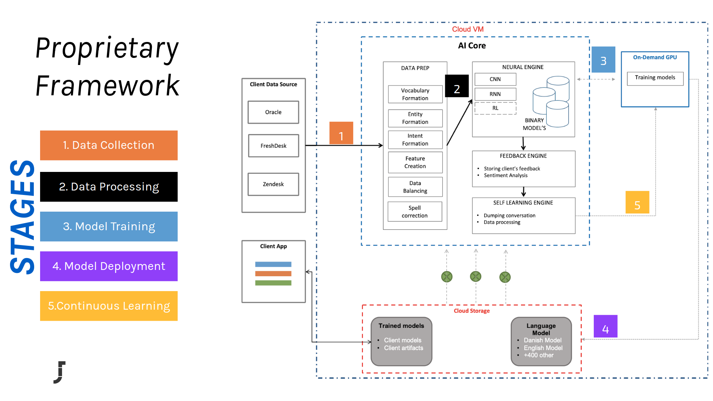

# JatanaAI's documentation!


JatanaAI is a deep learning based end-to-end natural language platform. JatanaAI aims to provide easy and fast experiences for using, deploying, and developing natural language processing for various industrial use cases. JatanaAI is mainly implemented using TensorFlow and Python.




## Prerequisites

- Python 2.7/3.6
- Java8+
- Ubuntu 16.x
- GCP Account

## Key competencies


Jatana NLU Engine is a highly scalable, data-driven engine with some unique capabilities like:

* **Cross-lingual and Multilingual Understanding** : It can handle emails composed of multiple languages.

* **Domain and Language Agnostic** :  It can learn the domain specific concepts from the data itself and in any provided language.

* **Advance real-time analytics** : It provides advance insight on the client data like Topic Modelling, Deep Summarizations, Hot Keywords, and Sentiment Analysis. Also, it serves the real-time analysis of how the model is performing. 

* **Continuous Learning** : It is capable of learning the new concepts and ideas over the period of time. Reinforcement learning, Meta Learning and Imitation learning are the key techniques used for the optimization.


!!! note
    This is the documentation for version |release| of JatanaAI which is specifically designed to work on Google Cloud in microservice mode.


## Components of JatanaAI

An overview of Jatana's internal modules looks:

* **Data Pipelines** : This module contains all the data processing and cleaning pipelines. We deployed various advance regex techniques for removing unwanted data. Also, these pipelines adjust based on the language detected. 

* **AI Core** : Brain behind JatanaAI is a hybrid combination of Deep Learning architectures like CNN's and RNN's which helps to capture the context in the provided text. It is further fine-tuned by performing transfer learning using the huge multilingual language models (like ELMO and BERT) which add the capability to understand text with multiple languages. Jatana Deep Learning architectures can handle various NLP problems like compositionality, polysemy, anaphora, long-term dependencies and bi-directional context.

* **Optimization** : This module is used to boost the performance of the existing model using the mechanism called continuous learning. This module also performs post training optimization on the models by various methods like Quantization, Pruning and Compress.

* **Serving** : This modules make JatanaAI planet scalable solution with the power of Tensorflow Serving. It uses GRPC and HTTP protocals to make the million request per second and auto manage the model's versioning.
 


## Sample Usage


Assume that you draft an email to the customer support, JatanaAI interprets the email, extracts the semantic and syntactic relations and responds with the list of most relevant answer.

!!! example 
    Hi Team,
    
    Last week I have ordered a product from your web shop after seeing an ad on my Facebook feed. 
    While completing the purchase I’ve selected the express shipment option to make sure I would receive the product as fast as possible. 
    More than a week has passed but and I haven’t received anything yet! 
    
    Can you please check what’s going on with my shipment? 
    Thanks,
    Frenk
    

and returns structured response like

```
    { 
        "possible_answers": [ 
            { 
                "answer1": "SHIPMENT_ISSUE", 
                "confidence": 0.93, 
                "answer_id": 360008597720 
            }, 

            { 
                "answer2": "WRONG_PRODUCT", 
                "confidence": 0.08, 
                "answer_id": 360008661139 
            }, 

            { 
                "answer3": "OPENING_HOURS", 
                "confidence": 0.07, 
                "answer_id": 360008598900 
            }, 

            { 
                "answer4": "PRODUCT_LAUNCHES", 
                "confidence": 0.06, 
                "answer_id": 360008661339 
            }, 

            { 
                "answer5": "REPAIRS", 
                "confidence": 0.05, 
                "answer_id": 360008661359 
            } 

        ], 

        "client": "jatana", 

    } 

```

