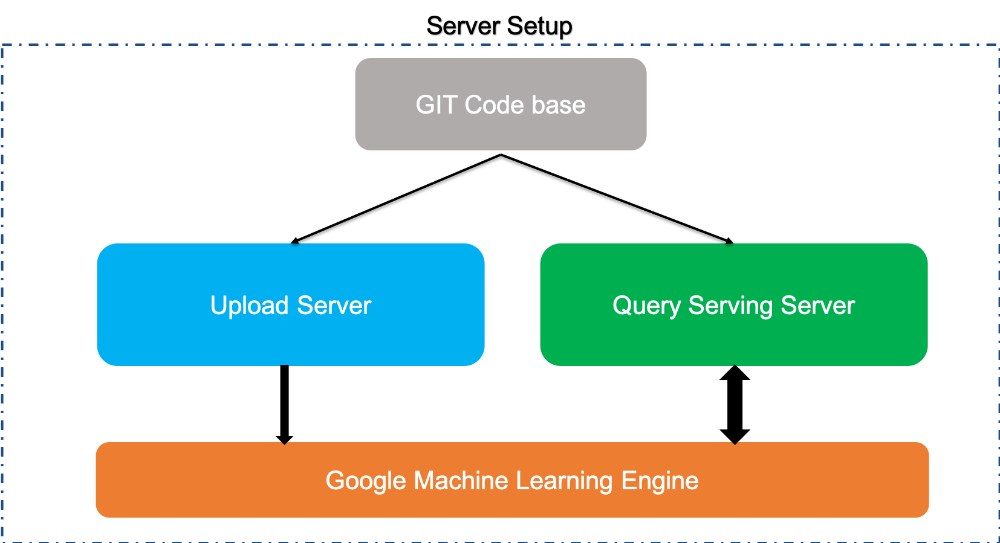

# Installation


## Prerequisites


JatanaAI has been tested with Python 2.7 and 3.6. It is recommended to use it with Python 2.7, we will soon port the complete code on Python3.7 but its not going to impact any interfaces.


There are primarily 2 server which we need to setup:

1. Upload server 
2. Query Serving Server



!!! note
	Setting up JatanaAI for lots of clients can require high configuration of systems for inferencing.


## Setting up Upload Server


Follow the instruction to setup the upload server.

### Config server


```
    sudo apt-get update
    sudo apt-get install apt-transport-https ca-certificates curl gnupg-agent software-properties-common
```

### Get the code 


Clone the repository 

```
    git clone https://github.com/jatana-ai/jatana-nlp-microservices
```


Unless you've already got numpy & scipy installed, we highly recommend that you install and use <a class="reference external" href="https://www.anaconda.com/download/" target="_blank">Anaconda</a>.


```
    cd jatana-nlp-microservices

    # create a virtual environment
    virtualenv -p python3.6 JatanaAI

    # activate the virtual environment
    source jatana-nlp-microservices/bin/activate

    # install dependencies
    pip install -r requirements.txt 

    # install gcfuse
    sudo apt-get install gcsfuse
 
    # setup storage using gcfuse
    mkdir data  
    gcsfuse jatana-nlp-storage data/
  
    # run service
    ./jatana-ms-upload/ignite.sh
```


### Test JatanaAI


```
    GET locahost:8080/api/ms/v3.0/ignition
```
and returns response

```
    {
      "Engine Status" : "Microservice for UPLOAD is alive and kicking"
    }
```


 

## Setting up Serving Server


### Config server


```
    sudo apt-get update
    sudo apt-get install     apt-transport-https     ca-certificates     curl     gnupg-agent     software-properties-common
    sudo apt-get install gcsfuse
    sudo apt install docker.io
```

### Setup GCFuse


```
    export GCSFUSE_REPO=gcsfuse-`lsb_release -c -s`
    echo "deb http://packages.cloud.google.com/apt $GCSFUSE_REPO main" | sudo tee /etc/apt/sources.list.d/gcsfuse.list
    curl https://packages.cloud.google.com/apt/doc/apt-key.gpg | sudo apt-key add -

    sudo apt-get install gcsfuse
```

### Get the code


Clone the repository 

```
    git clone https://github.com/jatana-ai/jatana-nlp-microservices
    cd /jatana-nlp-microservices/jatana-ms-train-v2/trainer
    mkdir data
    gcsfuse --implicit-dirs jatana-nlp-storage data/
```

### Get Tensorflow serving docker image


```
    docker pull tensorflow/serving
```

### Run the serving


```
    docker run  -p 8500:8500 -p 8501:8501 \
            --mount type=bind,source=/home/projects/jatana-nlp-microservices/jatana-ms-train-v2/trainer/data/export/,target=/models/ \
            -t tensorflow/serving \
            --model_config_file=/models/models.config
```


### Testing


If everything went fine then the service will be up and running and we can test that by hitting multiple enpoints.


#### Model status API


If you want to check the status of the model if can be done using

**Request**

```
    GET http://host:port/v1/models/${MODEL_NAME}[/versions/${MODEL_VERSION}]
```

``/versions/${MODEL_VERSION}`` is optional. If omitted status for all versions is returned in the response.


**Response**

```
    {
        "model_version_status": [
            {
                "version": "3",
                "state": "AVAILABLE",
                "status": {
                    "error_code": "OK",
                    "error_message": ""
                }
            }
        ]
    }
```

#### Model Metadata API

It returns the metadata of a model in the ModelServer. It returns the metadata of a model in the ModelServer.


**Request**

```
    GET http://host:port/v1/models/${MODEL_NAME}[/versions/${MODEL_VERSION}]/metadata
```

``/versions/${MODEL_VERSION}`` is optional. If omitted status for all versions is returned in the response.


Example:

```
    GET http://localhost:8501/v1/models/jatanademo_macro/metadata
```

**Response**

```
    {
        "model_spec": {
            "name": "jatanademo_macro",
            "signature_name": "",
            "version": "3"
        },
        "metadata": {
            "signature_def": {
                "signature_def": {
                    "predict": {
                        "inputs": {
                            "text": {
                                "dtype": "DT_INT32",
                                "tensor_shape": {
                                    "dim": [
                                        {
                                            "size": "-1",
                                            "name": ""
                                        },
                                        {
                                            "size": "100",
                                            "name": ""
                                        }
                                    ],
                                    "unknown_rank": false
                                },
                                "name": "model_1_input:0"
                            }
                        },
                        "outputs": {
                            "scores": {
                                "dtype": "DT_FLOAT",
                                "tensor_shape": {
                                    "dim": [
                                        {
                                            "size": "-1",
                                            "name": ""
                                        },
                                        {
                                            "size": "5",
                                            "name": ""
                                        }
                                    ],
                                    "unknown_rank": false
                                },
                                "name": "dense_1/Softmax:0"
                            }
                        },
                        "method_name": "tensorflow/serving/predict"
                    }
                }
            }
        }
    }  
```